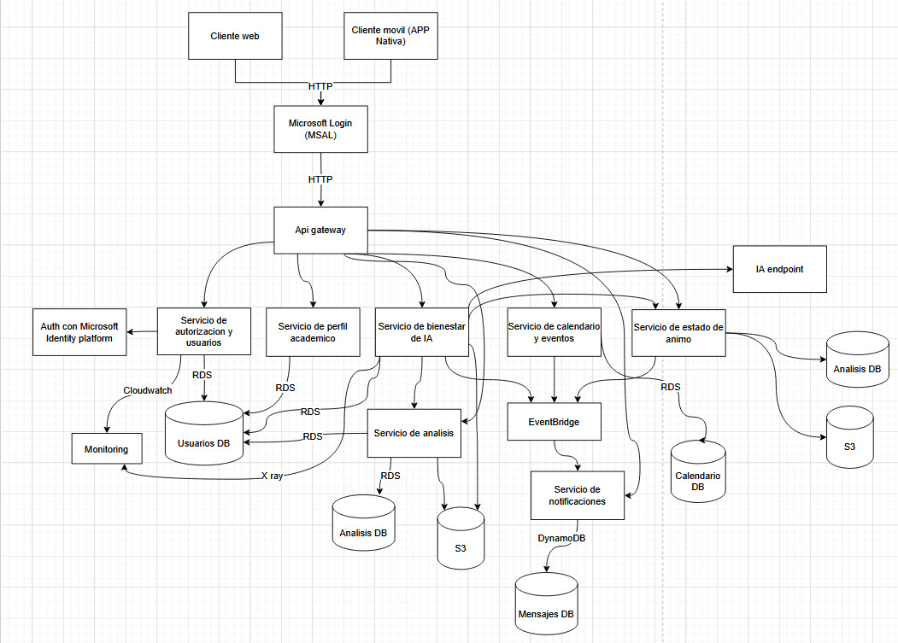

# Proyecto: Fry - Plataforma de Bienestar Emocional y Académico para Estudiantes

## ARCHITECTURE.md (Documentación de Arquitectura)

# Arquitectura del Proyecto Fry

La arquitectura de Fry ha sido diseñada bajo un enfoque de microservicios y escalabilidad en la nube, buscando optimizar la disponibilidad, resiliencia y facilidad de mantenimiento del sistema.

### Diagramas

### Principios de Diseño

- **Separación de responsabilidades**: Cada microservicio maneja un único tipo de dato o funcionalidad.
- **Alta disponibilidad y resiliencia**: Gracias a la separación y despliegue en AWS Fargate.
- **Escalabilidad independiente**: Cada servicio puede escalar según su carga específica.
- **Seguridad integrada**: Autenticación con Microsoft Identity Platform, control de acceso en API Gateway y bases de datos.
- **Flexibilidad de datos**: Bases de datos especializadas (PostgreSQL, DynamoDB, S3).
- **Análisis predictivo basado en IA**: Análisis de riesgos de estrés y deserción estudiantil mediante el procesamiento de datos reales.

### Componentes Principales

| Componente | Tecnología | Propósito |
|:-----------|:-----------|:----------|
| API Gateway | Amazon API Gateway | Orquestación de peticiones REST. |
| Backend Microservices | AWS Fargate (Django) | Manejo de perfiles, notas, asistencia, bienestar, IA, notificaciones. |
| Bases de Datos | RDS Aurora, DynamoDB, S3 | Almacenamiento relacional, NoSQL y archivos. |
| Machine Learning | OpenAI API / AWS SageMaker / Gemini API | Análisis de estrés, predicciones emocionales, predicción de riesgo de deserción. |
| Mensajería/Eventos | Amazon EventBridge | Comunicación desacoplada entre microservicios. |
| Monitoreo | AWS CloudWatch, X-Ray | Observabilidad del sistema. |
| Autenticación | Microsoft Identity Platform (MSAL) | Login seguro para estudiantes y universidades. |

### Flujo de Datos Principal

1. El estudiante se autentica mediante Microsoft Identity.
2. La aplicación registra sus clases, asistencia, notas, promedios (`Grades`) y estados de ánimo.
3. Los microservicios procesan esta información:
   - Se almacenan registros académicos en RDS.
   - Se gestionan mensajes de bienestar en DynamoDB.
   - Se almacenan archivos y reportes en S3.
4. Los administradores suben archivos o datos relevantes.
5. El servicio de Análisis IA procesa los datos:
   - Detecta patrones de estrés académico o emocional.
   - Predice riesgos potenciales de deserción.
   - Genera reportes y planes de acción sugeridos.
6. Se generan notificaciones y reportes semanales.

### Justificación de Microservicios

- Permiten actualizar o escalar partes del sistema sin afectar a otros.
- Facilitan el mantenimiento y el desarrollo iterativo.
- Preparan la plataforma para integraciones futuras (nuevos tipos de test, reportes, funcionalidades de IA).
- Separan eficientemente procesos académicos (clases, asistencia, calificaciones) de procesos emocionales (mood tracking, perfil de estrés).
